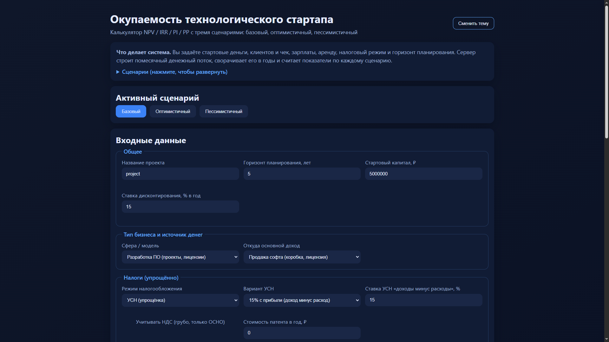
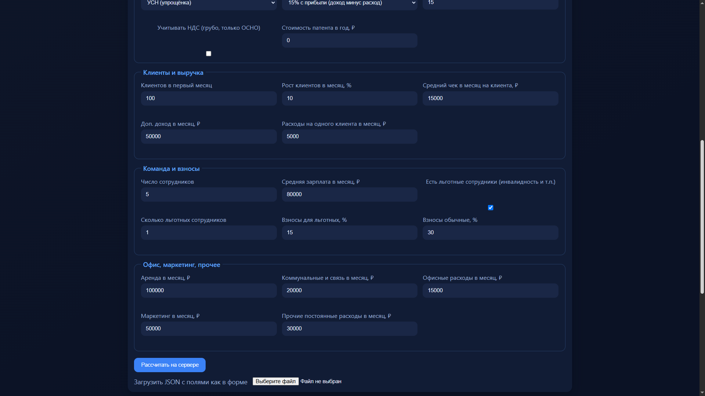
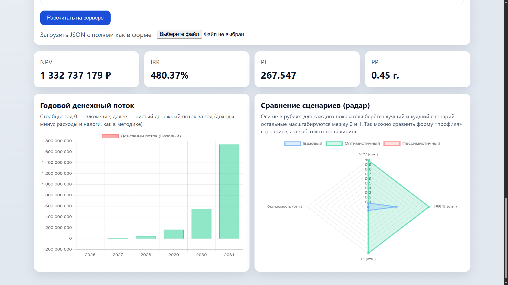

**Экономический калькулятор окупаемости технологического стартапа** - веб-приложение, которое по заданным пользователем бизнес-вводным строит финансовую модель и оценивает, насколько проект выгоден и когда он окупится.

# Функциональность
## Входные данные
Пользователь задаёт параметры проекта:
**Общее:** название, горизонт планирования (лет), стартовый капитал
**Бизнес-модель:** тип бизнеса (услуги, ПО, SaaS, интернет-магазин), источник дохода
**Доходы:** стартовое число клиентов, месячный рост, средний чек, доп. доход
**Расходы:** зарплаты, страховые взносы (в т.ч. льготные), аренда, коммуналка, маркетинг переменные затраты на клиента
**Налоги:** УСН / ОСНО / патент, ставки, НДС
**Дисконтирование:** ставка дисконтирования

## Расчёт
1) Строится помесячный денежный поток (доходы − расходы − налоги).
2) Поток агрегируется по годам.
3) Для каждого сценария считаются показатели:
**NPV** - чистая приведённая стоимость
**IRR** - внутренняя норма доходности (метод Ньютона + бинарный поиск)
**PI** - индекс прибыльности
**PP** - срок окупаемости

## Три сценария
**Базовый** - вводные без изменений
**Оптимистичный** - выше рост клиентов, ниже затраты на клиента, ниже ставка дисконтирования
**Пессимистичный** - ниже рост и стартовая база клиентов, выше затраты, выше дисконт

## Интерфейс
- форма с валидацией
- загрузка данных из JSON
- переключение сценариев
- карточки метрик (NPV, IRR, PI, PP)
- графики: столбчатый денежный поток и radar-сравнение сценариев
- светлая/тёмная тема

## Стек технологий
**Frontend:** HTML, CSS, vanilla JavaScript
**Графики:** Chart.js (CDN)
**Backend:** Python 3, стандартная библиотека (http.server, json, dataclasses)
**API:** POST /api/calculate — JSON на вход, JSON с результатами
**Архитектура:** клиент-сервер: статика + Python-расчёты на 127.0.0.1:8000
**Запуск:** python api_server.py или start_server.bat

## Структура Python-модулей
- main.py - оркестратор расчётов
- formulas_and_calculations.py - формулы, налоги, денежные потоки
- algorithms.py - IRR (Ньютон, бинарный поиск)
- scenarios.py - модификаторы сценариев
- data_structures.py - модели данных и валидация
- api_server.py - HTTP-сервер

Внешних Python-зависимостей нет - только стандартная библиотека. Проект рассчитан на учебную/практическую задачу по оценке экономической эффективности стартапа.

## Скриншоты
### Главная страница

### Графики

